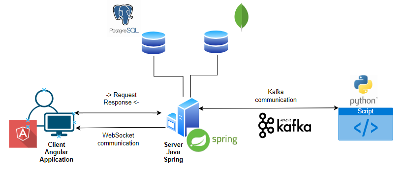
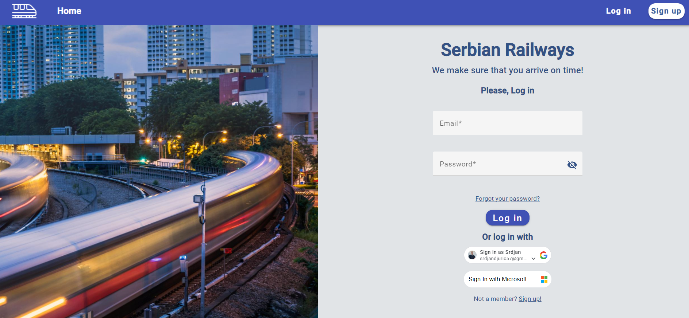
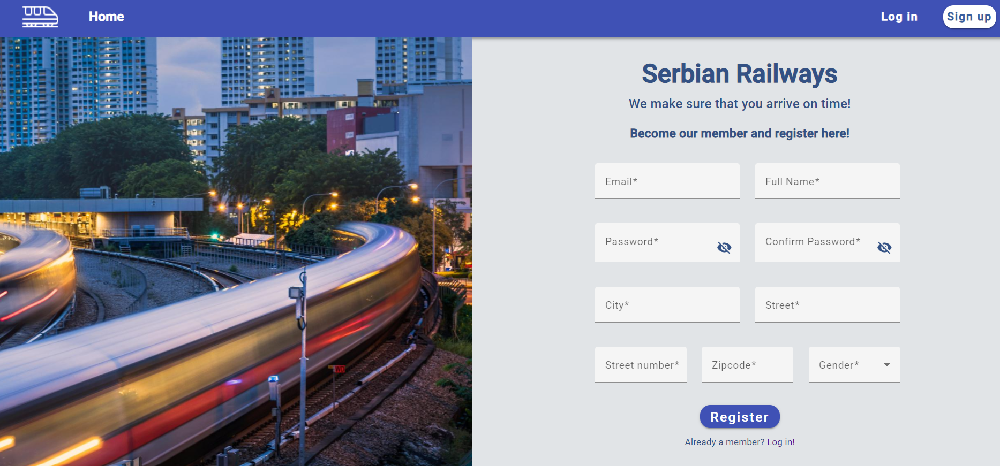
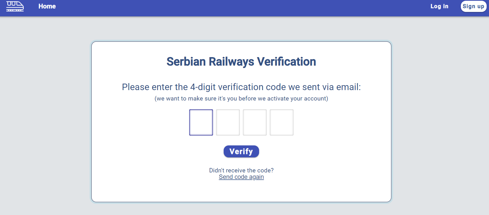
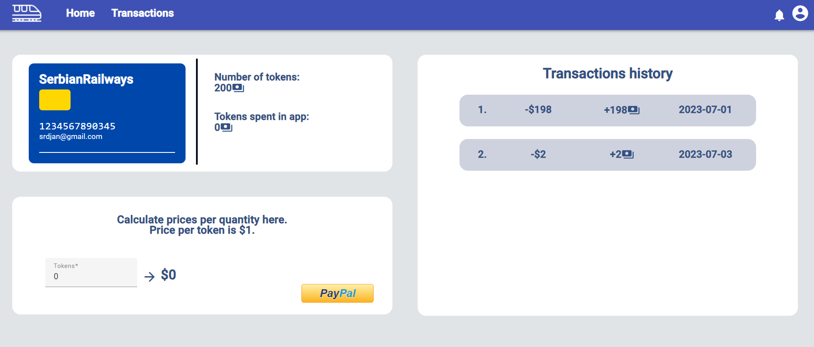
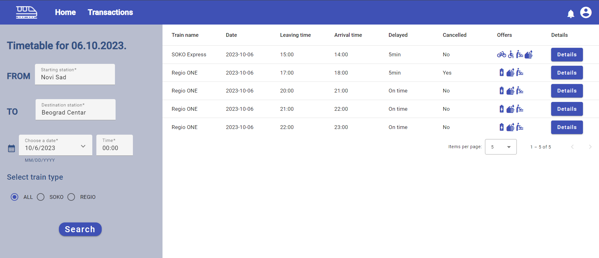
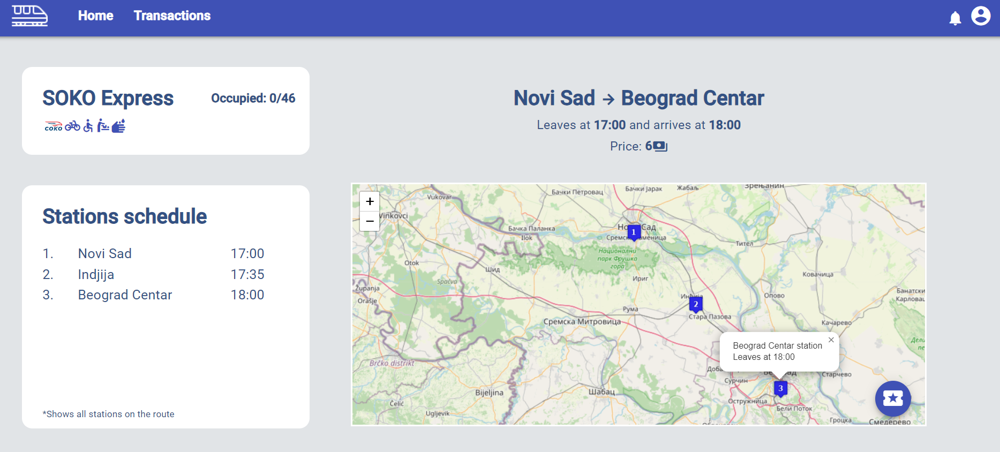
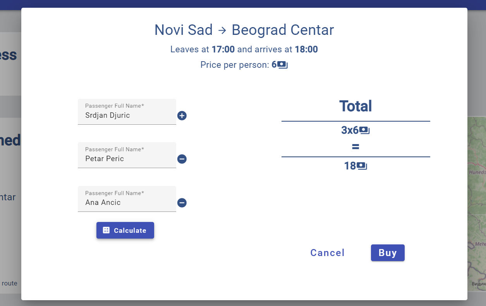
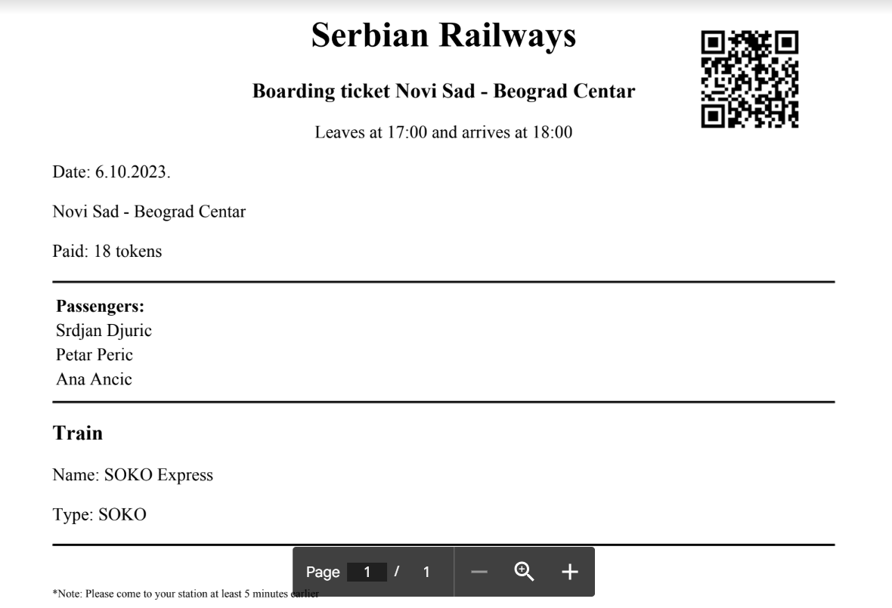

<h1 align="center">
  Web Application for Serbian Railways support in Real Time
   
</h1>

  • <a href="#-project-setup-and-commands">FTN, Novi Sad, 2023</a>
  •
   
  • <a href="#">Bachelor Degree Project</a>
  •
   
  • <a href="#">Demo Video YT</a>
  •

## 👨‍💻 Developer
    • Srđan Đurić           SW63-2019

## 🏗️ Application architecture

## 🚀 Project setup

#### :warning: *Pre requirements:*

- Installed Node
- Angular version 16
- JDK version 17
- PostgreSQL
- MongoDB
- Python version 3 and later
- Apache Kafka

#### :floppy_disk: *How to run backend:*

- Open Railway backend app in IntelliJ IDE as Maven project
- Click on reload project(Maven will update and download all dependencies)
- Configure paths and username/password for PostgreSQL and MongoDB in application.properties
- Apache Kafka must be installed and running on the OS
- Click on run button to run server

#### :floppy_disk: *How to run frontend:*

- Open angular-app in wanted IDE (VSCode, WebStorm etc.)
- Run npm install in terminal to install all needed dependencies
- Run ng serve in terminal to start application
#### :floppy_disk: *How to run python script:*
- pip install python-kafka
- click on run button in IDE

 

## 🤝 Useful to know:
- Railway application is using Leaflet maps and many other APIs, stable internet connection is needed
- You will need to reconfigure API keys for login with Google/Microsoft and paying via PayPal
since it's running in testing environment
- There are two types of user roles to login:
    - Admin (admin@gmail.com)
    - Regular user (srdjan@gmail.com)
- Password for all users is: sifra123@
- PostgreSQL configuration is set in application properties
- On server run the PostgreSQL will be populated with testing data
- MongoDB must be populated through endpoints and postman

## 🏗️ Project structure:
- BACKEND
    - main
        - java
            - config (project configuration classes)
            - controller (application endpoints are located here)
            - requests (request transfer objects)
            - response (response transfer objects)
            - exception (global exception handler and all exception types)
            - model (all entity classes and enumerations)
            - repository (classes with queries for reaching data from DB)
            - service (all bussines logic)
            - security (security logic)
            - util (helping functions and constants)
        - resources
            - application.properties
            - data-postgres.sql (script for populating database)
            - staticly stored images
            - spring email templates and configuration
- FRONTEND
    - enviroments (global constants that are needed across application)
    - modules
        - admin (components used only by admins)
        - auth (security based components)
        - material (imports for angular material)
        - regular (components used only by regular users)
        - root (starting point for frontend)
        - shared (components used by multiple user roles, interceptors etc.)
- Python Script
    - Simulates train delayes and cancellations in real time through Kafka  
* Note* All user based elements are consisting of pages, components and services

## 📎 Useful links:

- PostgreSQL: https://www.postgresql.org/
- MongoDB: https://www.mongodb.com/
- Maven: https://maven.apache.org/
- Angular: https://angular.io/
- Apache Kafka: https://kafka.apache.org/
- Srđan Đurić: https://www.linkedin.com/in/srdjan-djuric/

## 📱 Some photos of application

